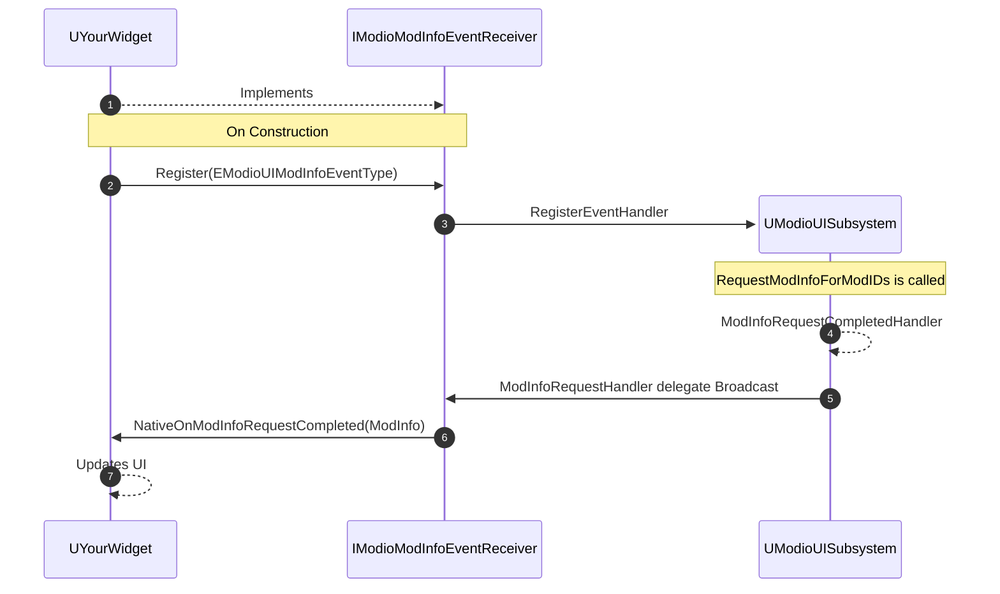
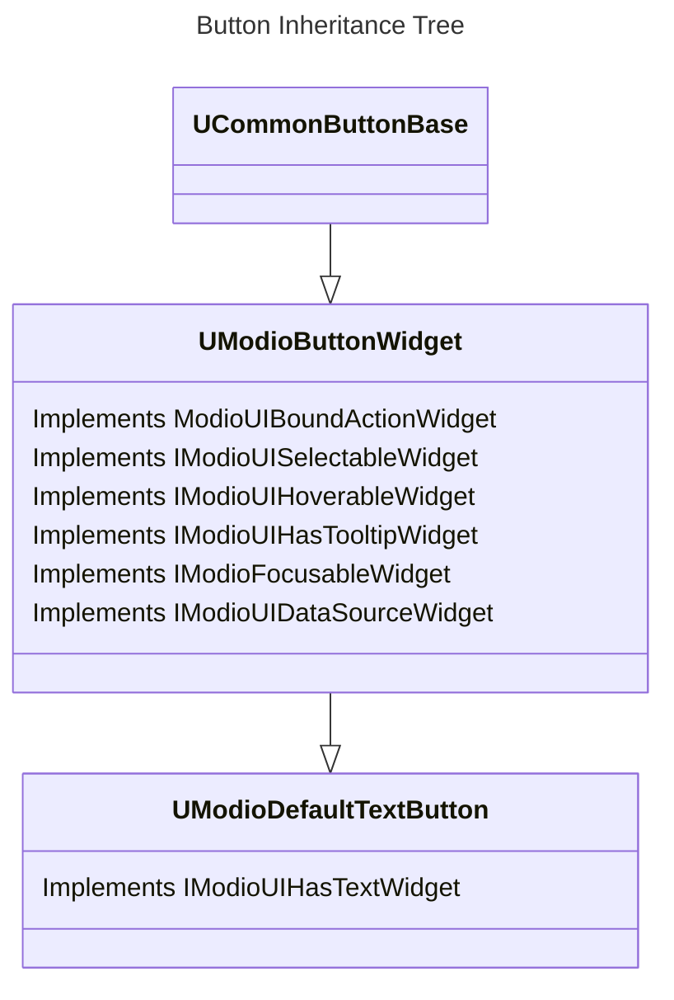

import Tabs from '@theme/Tabs';
import TabItem from '@theme/TabItem';

## `ModioUISubsystem`

The core mod.io plugin has an asynchronous model which requires callers to invoke each asynchronous function with a delegate that functions similarly to a callback in a standard C++ application. Upon execution of the asynchronous task, the delegate is invoked precisely once with parameters indicating the success or failure of the requested operation.

These delegates are single-cast delegates because Blueprint does not support multi-cast dynamic delegates as function parameters. This also parallels the underlying C++ SDK implementation. However, it has one limitation: by default, only a single event is emitted when the call completes. As a result, if one UI element makes a request that triggers a data model change, and multiple receivers want to know about those changes, the event requires "rebroadcasting" to objects other than the one that initiated the request. Individual widgets should not be responsible for this as it increases coupling between UI elements and imposes requirements about what widgets are included in the current screen layout.

The mod.io Component UI framework therefore includes the `UModioUISubsystem` — a subsystem that depends on the `UModioSubsystem` from the core plugin. This new subsystem acts as a single-to-many broadcast adaptor for mod.io plugin callbacks. It is a singleton that manages a set of internal multicast delegates, allowing UI elements to register with this subsystem to receive notifications when those multicast delegates are broadcasted. By calling `ModioSubsystem` methods *through* the UI subsystem, the UI subsystem can provide its own delegate to the underlying core plugin and trigger a broadcast of the relevant multicast delegate when the operation completes, notifying all registered UI elements. Each `ModioUISubsystem` event has a context value which can be used as a discriminant by UI elements so they can respond to a filtered subset of relevant events. For example, `RequestListAllMods` takes in a request ID that widgets can use to determine if this is their own list being returned or something else.

## Event handler interfaces

To receive or handle mod.io events triggered by other widgets, a component implements a "Receiver" interface and then "registers" itself to bind the receiver interface methods to the UI subsystem's internal delegates. Using interfaces for widgets that wish to register for event notifications promotes loose coupling between the receiving widgets and the UI subsystem. The UI subsystem knows little about what objects are listening for events other than that they implement the given receiver interface — in theory, non-widget `UObjects` could also register for these events.

The following sequence is a high-level example of this; it applies to all of the Event Handler Interfaces.

### Registering for events triggered by other UI widgets

For an event to be received, the implementing widget must bind a delegate to the UI subsystem's internal multicast delegates. This is accomplished by two methods:

* Each interface provides a protected templated `Register<>` function that can be called by native classes implementing the interface.
* Each interface has a corresponding Blueprint Function Library with a `BlueprintCallable` method that can perform the registration if given a `UObject` implementing that interface.

Once registration is performed, the UI subsystem will handle invoking the relevant interface functions on the implementing object to notify it of appropriate events.

### Deregistering events

As a best practice, ensure that events are deregistered when no longer needed. Similarly to registration, this is achieved by two opposing methods:

* Each interface provides a protected templated `Deregister<>` function that can be called by native classes implementing the interface.
* Each interface has a corresponding Blueprint Function Library with a `BlueprintCallable` method that can perform the deregistration if given a `UObject` implementing that interface.

### Implementation details

* The templated `Register<>` method binds a `UObject`-based delegate to a native handler function on the interface, which can be overridden in implementing classes. The default implementation of that native function invokes a `UFUNCTION` on the receiving interface, which is the actual function that implementing classes should override, either natively or in Blueprint.

* Objects that implement the receiving interface via Blueprint only (i.e., do not have a native base class which inherits the receiving widget) do not actually inherit from the interface. Unreal copies `UFUNCTION` stubs into the `BlueprintGeneratedClass` that match the public `UFUNCTIONs` declared in the interface, but nothing else. As a result, the native handler function is not present in a pure Blueprint class that implements the interface. Instead, a non-templated `BlueprintCallable` `UFUNCTION` is used to handle registration. Rather than binding directly to a native handler of a `UObject`, this helper binds a static method to the delegate and captures a weak pointer to the widget, which is later used to invoke the Blueprint implementation of the relevant interface function. As this function does not need to be virtual, and requires a default implementation to be helpful to consumers, it can't be implemented on the `UInterface` directly (non-overridable functions with a default implementation are not permitted in interfaces) and instead is implemented in an associated Blueprint Function Library.

## Component interfaces

Component interfaces each define a set of related functionality or operations that can be performed on a widget. Components in the framework are specified in terms of their constituent interfaces rather than specific base classes, facilitating the incorporation and reuse of existing UI widgets from the host project. For instance, an Editable Text component is any widget that implements `IModioUIStringInputWidget` and `IModioUITextValidator`. This could be a subclass of `UEditableTextBox`, or a `UUserWidget` that *contains* a `UEditableTextBox`. It could also be a UMG `UUserWidget` containing (at some level of the hierarchy) an entirely custom `UWidget` that a studio has implemented to handle gathering user input. The mod.io default components and the Template UI make no other assumptions.

For example, the various Button classes included in the ComponentUI plugin only implement the given interfaces where they become relevant, and at no point in the hierarchy is the specific class of the widget required to access any of its functionality.

## Data binding interfaces

Data Binding interfaces are intended to give studios flexibility when developing their own custom complex layouts using the component UI framework. Data binding for mod.io components is done via the concept of a Data Source — a `UObject` that wraps some underlying data that the component can query and subsequently visualize or otherwise operate on. By defining common Data Binding interfaces, widgets don't need to know the explicit type of the data they are visualizing. For example, Mod Tile components are responsible for visualizing a `FModioModInfo` object. However, mods installed on a system are `FModioModCollectionEntry` objects. Without using Data Binding interfaces, a Mod Tile would need to inspect the concrete type of a Data Source to know if it was wrapping a `FModioModInfo`, such as a mod returned from a server-side search query, or a `FModioModCollectionEntry` returned from the locally installed mods. Instead, a Mod Tile requires its data source to implement `IModioModInfoUIDetails`, which exposes `GetModID` and `GetFullModInfo` methods. Both a data binding `UObject` for a `FModioModCollectionEntry` and a data binding `UObject` for `FModioModInfo` can implement this method, allowing the Mod Tile to use that interface to access the associated mod's data without concern for the concrete underlying type.

This can be further extended. For example, one of these wrappers around a `FModioModInfo` or `FModioModCollectionEntry` could also implement `IModioUserUIDetails`, allowing the data object to be queried for a user. This implementing wrapper could return the mod's creator, enabling the same component to visualize mod.io users from any context.