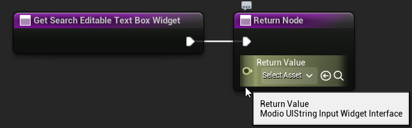
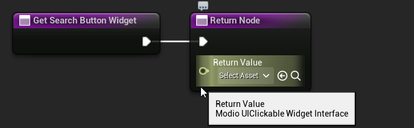
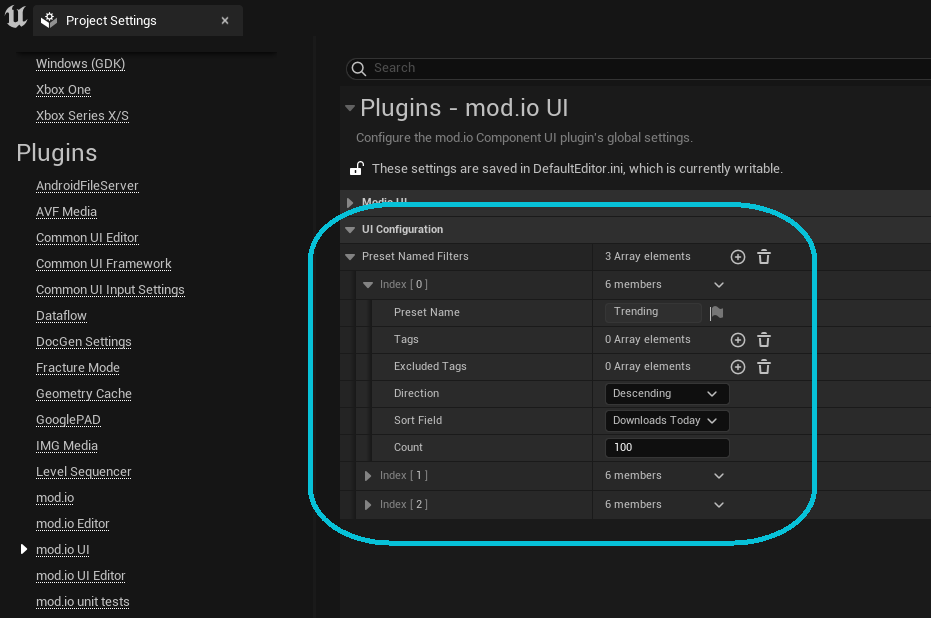
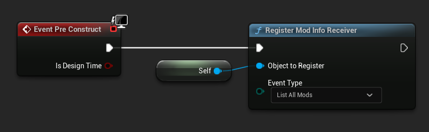
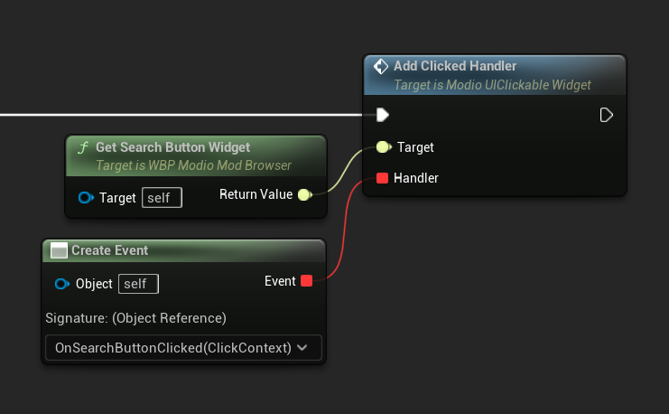

The majority of work involved in implementing the mod.io [Component UI](https://docs.mod.io/in-game-ui/component) framework will be building custom UI layouts for consuming content from mod.io by assembling components into more complex layouts.  This is a step-by-step guide demonstrating the appropriate workflow for building such a screen. 

Here's the end result of this guide:


*A basic mod browser widget in-editor*


*A basic mod browser widget in-game*

## Creating the outer `UserWidget`

### Components

This step involves creating an outer `UserWidget` that will contain the different components. This widget will also handle passing messages between its components in response to user input. 

The outer widget requires the following components:

* List of preset filters (Trending, Recent, and Popular) for the user to select
* Search input box
* Search button
* List of mod tiles

### Interfaces

Regardless of whether the logic is implemented in Blueprint or C++, the enclosing widget will need to be able to reference those components inside it. To make the layout as flexible as possible, we recommend avoiding direct references to widgets via member variables in the enclosing class.

The ideal implementation uses getter functions to return a reference to each component, typed as a `UWidget` with a desired interface rather than the concrete widget type. This allows implementations to switch out the concrete type of the component at any time without causing Blueprint links to break. In contrast to using `UPROPERTY` widget references with `BindWidget`, it also allows the inner widget to live anywhere within the hierarchy — even inside a subwidget.  


*The outer widget contains 4 components.  Each component implements the relevant interface for its functionality.*

This approach is used widely in the default component implementations and the default layout template included in the mod.io Component UI plugin. 

Getter functions can be implemented in either C++ or Blueprint:

<Tabs groupId="languages">
	<TabItem value="cpp" label="C++" default>

	1. Create a C++ class deriving from `UUserWidget`
	2. Create the following stub functions in the widget:

		 ```cpp
		TScriptInterface<IModioUIObjectSelector> GetPresetFilterSelectorWidget() { return nullptr; }
		TScriptInterface<IModioUIModListViewInterface> GetModTileViewWidget() { return nullptr; }
		TScriptInterface<IModioUIStringInputWidget> GetSearchEditableTextBoxWidget() { return nullptr; }
		TScriptInterface<IModioUIClickableWidget> GetSearchButtonWidget() { return nullptr; }
		```
	</TabItem>
	<TabItem value="blueprint" label="Blueprint">

	1. Create a new Widget Blueprint in the editor
	2. Create the following stub functions in the widget:

		

		

		

		

	</TabItem>
</Tabs>

## Adding the preset filter selector

The [Preset Filter Selector](/unreal/ui-refdocs#preset-filter-selector) component presents a game-defined list of preset filter values for a user to select. These filters can be passed to any plugin function that accepts a `FModioFilterParams` object. In this mod browser, the filter selector will be used to allow a user to quick-search. The list of preset filters is configurable via the mod.io plugin settings in the editor's **Project Settings** dialog.

1. Add a `UModioPresetFilterSelector`-derived widget (such as the default `WBP_ModioDefaultPresetFilterSelectorWidget` from the reference design) to the hierarchy of the mod browser `UserWidget`.

2. Modify `GetPresetFilterSelectorWidget` to return a reference to the selector instance added in step 1.


3. Configure the preset list of filters in the **Project Settings** dialog:



## Binding an event handler to the filter selector

In order to use the selected filter parameters to search for mods, the mod browser `UserWidget` needs to handle a **selection changed** event being emitted from the filter selector.

The browser will need to provide a function with the appropriate signature, bind it to a delegate, and pass that delegate to the filter selector so that it can be invoked when the user changes their selection. The browser should access the filter selector via the getter function `GetPresetFilterSelectorWidget()` to ensure that changing the concrete type of the filter selector will not break consuming code.


<Tabs groupId="languages">
	<TabItem value="cpp" label="C++" default>
		1. Create a method on the `UserWidget` class that is marked `UFUNCTION()` and has a signature that matches `FModioOnObjectSelectionChanged`. Note that the method does not need to be `public`.
		 ```cpp
		UFUNCTION()
		void HandlePresetFilterSelectionChanged(UObject* SelectedValue){}
		```
		2. Call `Execute_AddSelectionChangedHandler` on the object returned from `GetPresetFilterSelectorWidget()` in `NativeOnInitialized`, and bind the event to the method created in step 1.
		 ```cpp
		// UModioModBrowser is the default mod browser widget class. Replace with your own class name
		void UModioModBrowser::NativeOnInitialized()
		{
		    Super::NativeOnInitialized();
		    if (TScriptInterface<IModioUIObjectSelector> FilterSelector = GetPresetFilterSelectorWidget())
			{
				FModioOnObjectSelectionChanged OnPresetFilterChanged;
				OnPresetFilterChanged.BindDynamic(this, &UModioModBrowser::HandlePresetFilterSelectionChanged);
				FilterSelector->Execute_AddSelectionChangedHandler(FilterSelector.GetObject(), OnPresetFilterChanged);
			}
		}
		```
	</TabItem>
	<TabItem value="blueprint" label="Blueprint">
		1. Create a new function with one input parameter of type Object.

		

		2. Call `AddSelectionChangedHandler` on the object returned from `GetPresetFilterSelectorWidget()` in `Event On Initialized`, and bind the event to the function created in step 1.

		
	</TabItem>
</Tabs>

## Implementing the bound handler and making mod queries

Your mod browser now has an event handler which will be executed when the user changes which filter they want to apply, but that handler currently does not have an implementation. The handler needs to retrieve the information about the selected filter and initiate a query for matching mods using the plugin.

The **Preset Filter Selector** is a specialization of the [**Object Selector**](/unreal/ui-refdocs#object-selector) and will emit **Selection Changed** events, providing bound handlers with a `UObject` representing the newly selected filter. The component specification requires that the `UObject` implement the `IModioModFilterUIDetails` interface, which allows it to be queried for the `FModioFilterParams` that the `UObject` represents.

As a result, the selection changed handler can retrieve the associated `FModioFilterParams` from the user's selection, and submit that to the mod.io REST API via the plugin to retrieve results.

<Tabs groupId="languages">
	<TabItem value="cpp" label="C++" default>
	1. In the handler function's implementation, call `Execute_GetFilterParams` (from the `IModioModFilterUIDetails` interface) on the selection object passed to the handler.
	2. Invoke `UModioUISubsystem::RequestListAllMods`, passing the `FilterParams` retrieved in step 1 and a string identifier to uniquely identify the request source. The identifier allows widgets that register for events when a new result set is available to know the originating widget and whether the event is one they should respond to.
	3. Store the identifier in a member variable so that it can be validated against later.
	 ```cpp
	// header .h file:

	FString AllParamsSearch_RequestIdentifier = TEXT("AllParamsSearch");
	```
	 ```cpp
	// implementation .cpp file:
	// UModioModBrowser is just a placeholder class name. Replace with your own class name

	void UModioModBrowser::OnPresetFilterChanged(UObject* SelectedValue)
	{
	    if (SelectedValue.GetClass()->ImplementsInterface(UModioModFilterUIDetails::StaticClass()))
		{
			FModioFilterParams FilterParams = FilterDetails->Execute_GetFilterParams(SelectedValue);
			if (UModioUISubsystem* Subsystem = GEngine->GetEngineSubsystem<UModioUISubsystem>())
			{
				Subsystem->RequestListAllMods(FilterParams, AllParamsSearch_RequestIdentifier);
			}
		}
	}
	```
	</TabItem>
	<TabItem value="blueprint" label="Blueprint">
	1. In the handler function's implementation, call `GetFilterParams` message function on the selection object passed to the handler.
	2. Invoke `RequestListAllMods` from Modio UI Subsystem and pass the FilterParams retrieved in step 1, and a string identifier to uniquely identify the request source. The identifier allows widgets that register for events when a new result set is available, to know the originating widget and whether the event is one they should respond to.
	3. Store the identifier in a member variable so that it can be validated against later.

	
	</TabItem>
</Tabs>

## Adding the mod list visualizer

The mod browser requires some widget that is able to visualize or display the results of the filter that was used in the query. The `IModioUIModListViewInterface` interface was designed specifically for implementation by widgets that are capable of such visualization, and one of the default implementations of this interface supplied by the plugin is `UModioDefaultModTileView`.

1. Add a `ModioDefaultModTileView` to the widget's hierarchy, and alter the implementation of `GetModTileViewWidget` so that it returns a reference to the widget in question. Alternatively, use a `UModioDefaultModListView` to display the mods as a vertical or horizontal list instead of a grid.
2. Specify the Entry Widget class to use for the tile view, such as the default `WBP_ModioDefaultModTile` from the reference design, which is derived from `UModioDefaultModTile`.


## Passing data between components

Now that the mod browser is requesting search results via the mod.io plugin, it needs to consume those results as they become available.

The mod.io UI framework provides a number of interface classes that widgets can implement in order to register as event receivers for different sorts of async events, such as the user's subscriptions changing, or to be notified when a set of search results have been fetched.
In this instance, the mod browser must implement `IModioUIModInfoReceiver`, which is an interface indicating that the implementing widget wants to receive notifications/events when the mod.io subsystem returns a set of mod info objects (list of mods) from the REST API.

Once that interface is implemented, the widget can register to receive events when a set of mod objects are returned. Registering for these events automatically binds functions on the implementing widget to delegates inside the `UModioUISubsystem`, so it will receive callbacks when results are available. Then, when the widget receives the event indicating the results have been fetched, it can pass those mod objects onto the widget returned from `GetModTileViewWidget` for display.

<Tabs groupId="languages">
	<TabItem value="cpp" label="C++" default>
		1. Modify the mod browser widget so that it inherits from `IModioUIModInfoReceiver`.
		2. In `NativePreConstruct`, invoke `IModioUIModInfoReceiver::Register`.
		 ```cpp
		// header .h file:

		virtual void NativePreConstruct() override;
		```
		 ```cpp
		// implementation .cpp file:
		// UModioModBrowser is just a placeholder class name. Replace with your own class name

		void UModioModBrowser::NativePreConstruct()
		{
		    Super::NativePreConstruct();
		    IModioUIModInfoReceiver::Register<UModioModBrowser>(EModioUIModInfoEventType::ListAllMods);
		}
		```
		3. Implement the event handler for `ListAllMods` to return a result by overriding `NativeOnListAllModsRequestCompleted`.
		4. In the event handler, validate the request identifier against the one stored earlier when the request was made.
		5. Handle the error code if it is populated, as well as the case where the list of mods is not set.
		6. Call `Execute_SetModsFromModInfoList` function on the widget returned by `GetModTileViewWidget()` (`IModioUIModListViewInterface` interface).
		 ```cpp
		// header .h file:

		virtual void NativeOnListAllModsRequestCompleted(FString RequestIdentifier, FModioErrorCode ErrorCode, TOptional<FModioModInfoList> List);
		```
		 ```cpp
		// implementation .cpp file:
		// UModioModBrowser is just a placeholder class name. Replace with your own class name

		void UModioModBrowser::NativeOnListAllModsRequestCompleted(FString RequestIdentifier, FModioErrorCode ErrorCode, TOptional<FModioModInfoList> List)
		{
			IModioUIModInfoReceiver::NativeOnListAllModsRequestCompleted(RequestIdentifier, ErrorCode, List);

			// Optional check if the request identifier matches the one we used
			if (AllParamsSearch_RequestIdentifier != RequestIdentifier)
			{
				return;
			}

			// Check if the request was successful and the list of mods is set/valid
			if (ErrorCode || !List.IsSet())
			{
		        UE_LOG(LogTemp, Error, TEXT("Error fetching mods: %s"), *ErrorCode.GetErrorMessage());
				return;
			}

			// Set the mods on the mod tile view widget
			if (UWidget* ModTileWidget = ModioUI::GetInterfaceWidgetChecked(GetModTileViewWidget()))
			{
				IModioUIModListViewInterface::Execute_SetModsFromModInfoList(ModTileWidget, List.GetValue(), false);
			}
		}
		```
	</TabItem>
	<TabItem value="blueprint" label="Blueprint">
		1. In your Widget Blueprint's **Class Settings**, add `ModioUIModInfoReceiver` as an implemented interface.
		2. In `PreConstruct`, invoke `RegisterModInfoReceiver()` (if it is not already called in the parent class).

		

		3. Implement the event handler for `ListAllMods` to return a result by overriding `OnListAllModsRequestCompleted`.
		4. In the event handler, validate the request identifier against the one stored earlier when the request was made.
		5. Handle the error code if it is populated, as well as the case where the list of mods is not set.
		6. Call `SetModsFromModInfoList` function on the widget returned by `GetModTileViewWidget()` (`ModioUIModInfoReceiver` interface).

		
	</TabItem>
</Tabs>

## Adding components for simple text search

To perform simple text search the mod browser widget requires two more sub-widgets: one for entering text, and the other for submitting the search text and retrieving results.

1. Add a `ModioDefaultEditableTextBox` to the browser's hierarchy.
2. Modify `GetSearchEditableTextBoxWidget` to return a reference to the editable text box.
3. Add a `ModioDefaultButton` to the browser's hierarchy.
4. Configure the default properties on the button so that the button's label is set to the required value.
5. Modify `GetSearchButton` to return a reference to the new button. 

## Binding an event handler to the search button

In similar fashion to the preset filter selector earlier, `ModioDefaultButton` implements `IModioUIClickableWidget`. In order to submit a search, the mod browser will need to add a handler for the "Clicked" event emitted by the search button. 

<Tabs groupId="languages">
	<TabItem value="cpp" label="C++" default>
		1. Create a method on the `UserWidget` class that is marked `UFUNCTION()` and has a signature that matches `FModioClickableOnClicked`.
		 ```cpp
		UFUNCTION()
		void HandleSearchButtonClicked(UObject* ClickContext){}
		```
		2. Call `Execute_AddClickedHandler` on the object returned from `GetSearchButtonWidget()`, in `NativeOnInitialized`, and bind the event to the method created in step 1.
		 ```cpp
		// UModioModBrowser is just a placeholder class name. Replace with your own class name

		void UModioModBrowser::NativeOnInitialized()
		{
		    Super::NativeOnInitialized();
		    if (UWidget* SearchButtonWidget = ModioUI::GetInterfaceWidgetChecked(GetSearchButtonWidget()))
			{
				FModioClickableOnClicked OnSearchButtonClicked;
				OnSearchButtonClicked.BindDynamic(this, &UModioModBrowser::HandleSearchButtonClicked);
				IModioUIClickableWidget::Execute_AddClickedHandler(SearchButtonWidget, OnSearchButtonClicked);
			}
		}
		```
	</TabItem>
	<TabItem value="blueprint" label="Blueprint">
		1. Create a new function with one input parameter of type Object.

		

		2. Call `AddClickedHandler` on the object returned from `GetSearchButtonWidget()`, in `OnInitialized`, and bind the event to the function created in step 1.

		
	</TabItem>
</Tabs>

## Implementing the search button event handler

Now that the mod browser is handling the clicked event from the search button, the user's search string needs to be retrieved and submitted to the mod.io plugin as a filter for `ListAllModsAsync`.

The `ModioDefaultEditableTextBox` created earlier meets the requirements of the EditableText component, by implementing `IModioUIStringInputWidget`. This interface allows the implementing widget to be queried for some kind of string representing user input. 

Once the user's input is retrieved from the text box, it can be incorporated into a set of `FModioFilterParams` and submitted.

<Tabs groupId="languages">
	<TabItem value="cpp" label="C++" default>
		1. Inside the handler bound in the previous step (`OnSearchButtonClicked`), Call `GatherInput` on the widget returned by `GetSearchEditableTextBoxWidget` and store the resulting string.
		2. Create an `FModioFilterParams` object, and use the `NameContains` function on it, passing the string returned by `Execute_GatherInput` from the `IModioUIStringInputWidget` interface. 
		3. Call `UModioUISubsystem::RequestListAllMods` as earlier, passing a request ID.
		 ```cpp
		// UModioModBrowser is just a placeholder class name. Replace with your own class name

		void UModioModBrowser::OnSearchButtonClicked(UObject* ClickContext)
		{
			if (UWidget* SearchButtonWidget = ModioUI::GetInterfaceWidgetChecked(GetSearchEditableTextBoxWidget()))
			{
				FString GatheredInput = IModioUIStringInputWidget::Execute_GatherInput(SearchButtonWidget);
				FModioFilterParams FilterParams; // Can be replaced with the filter returned from OnPresetFilterChanged
				FilterParams.NameContains(GatheredInput);
				if (UModioUISubsystem* Subsystem = GEngine->GetEngineSubsystem<UModioUISubsystem>())
				{
					Subsystem->RequestListAllMods(FilterParams, RequestIdentifier);
				}
			}
		}
		```
	</TabItem>
	<TabItem value="blueprint" label="Blueprint">
		1. Inside the handler bound in the previous step (`OnSearchButtonClicked`), Call `GatherInput` on the widget returned by `GetSearchEditableTextBoxWidget` and store the resulting string.
		2. Create an `FModioFilterParams` object, and use the `NameContains` function on it, passing the string returned by `GatherInput`. 
		3. Call `RequestListAllMods` as earlier, passing a request ID.

		

	</TabItem>
</Tabs>

Note there is no need to create another handler for the `ListAllModsCompleted` event; the existing handler will be invoked for both preset filter requests and user search string requests.

## Next Steps

The mod.io functionality for a basic mod browser widget is now complete. You may apply any layout and styling changes as desired — our example makes use of a background border, horizontal and vertical boxes, and in-built sizing and padding options found in the details panel of each sub-component.

Once you are satisfied with your simple mod browser, [Initialize](/unreal/initialization) the mod.io plugin using your game's API key and Game ID, and add your new widget to the viewport so users can [Search for UGC](/unreal/searching-ugc).

To learn how to switch existing components in and out, check out our [Substituting Components](/unreal/component-ui/substitute-components/) guide.

