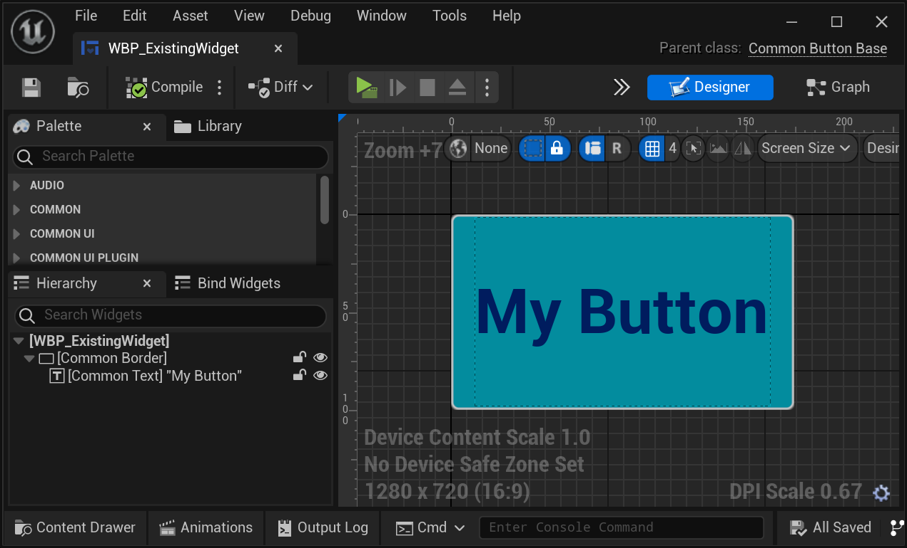
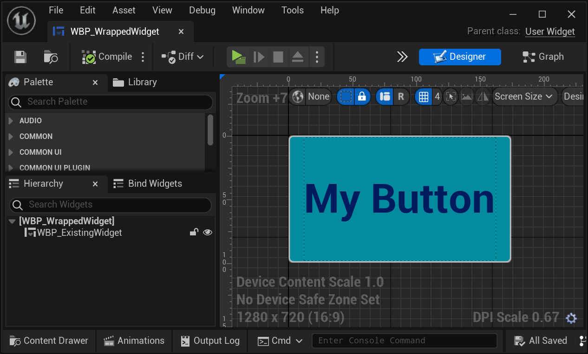
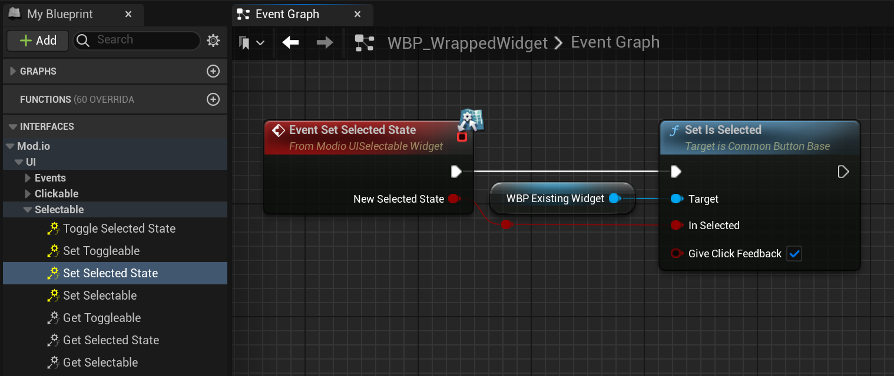
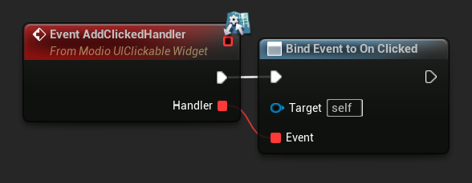
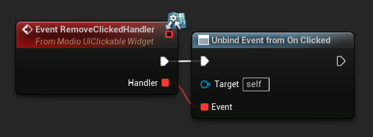
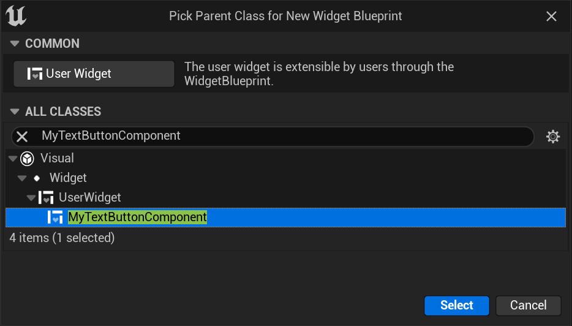
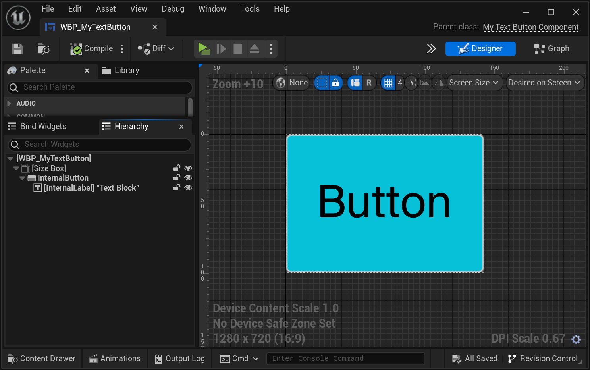

# Creating Custom Components

The [previous guide](https://docs.mod.io/unreal/component-ui/substitute-components) explains how interfaces are used throughout `WBP_ModioModBrowser` to enable easy customization by substituting mod.io components for your own custom components.

There are 3 ways to create a custom component for use in the mod.io [Component UI](https://docs.mod.io/in-game-ui/component) framework:

* Wrapping an existing `UWidget` or `UUserWidget` (including derived classes) and implementing the required interfaces on the wrapper
* Creating a new `UWidget` or `UUserWidget` (including derived classes) and implementing the required interfaces in the new widget
* Subclassing an existing `UWidget` or `UUserWidget` (including derived classes) and applying the mod.io interfaces directly

## Wrapping an existing widget

Wrapping an existing widget is the simplest and easiest way to ensure consistency of behaviour and styling between the mod browser and the rest of the project. This option is useful if you already have a set of UI widgets in your game which you would also like to use in your mod browser. By non-intrusively wrapping these widgets, the style and function of the original widget remains intact.

### Wrapping an existing button

This example demonstrates wrapping an existing simple Common UI button:



1. Create a new **Widget Blueprint** in the Unreal Editor.  Select **User Widget** as its parent. Add the existing widget into the hierarchy.



2. Check the [UI documentation](https://docs.mod.io/unreal/ui-refdocs) for a list of the expected interfaces for the widget you're looking to replace.  The [documentation for a button](https://docs.mod.io/unreal/ui-refdocs#button) specifies the following interfaces:
    - `IModioUIClickableWidget`
    - `IModioUISelectableWidget`
    - `IModioUIHoverableWidget`
    - `IModioUIHasTooltipWidget`
    - `IModioUIDataSourceWidget`

Add these interfaces to the wrapped Widget Blueprint in **Class Settings** under **Details -> Interfaces -> Implemented Interfaces**.


3. Implement the required interface functions.  Generally this involves forwarding on the interface function calls to the inner widget.  

Some functions, such as `SetSelectedState()`, can be directly called on the inner widget:



Others, such as `AddClickedHandler()`, may require the use of event dispatchers. 

`IModioUIClickableWidget.h` shows that `AddClickedHandler()` expects a handler of type `FModioClickableOnClicked` — a dynamic delegate with one `UObject*` parameter.

 ```cpp
DECLARE_DYNAMIC_DELEGATE_OneParam(FModioClickableOnClicked, UObject*, ClickContext);

UFUNCTION(BlueprintCallable, BlueprintNativeEvent, Category = "mod.io|UI|Events|Clickable")
void AddClickedHandler(const FModioClickableOnClicked& Handler);
```

To forward this interface function call, create an `OnClicked` event dispatcher for the wrapped widget that also takes an `Object` reference:  


When the `AddClickedHandler()` event is invoked, it can assign `Handler` to `OnClicked`:  



`RemoveClickedHandler()` is implemented in the same way:



`OnClicked` can then be called whenever the inner widget's `OnButtonBaseClicked` event is invoked:


Once the required interface functions are implemented, the widget is ready for use.

## Creating a new widget

The mod.io component UI framework [emphasises flexibility and composability for widgets](https://docs.mod.io/unreal/component-ui#emphasise-flexibility-and-composability-for-widgets).  This allows developers to easily create new widgets by combining existing components.  

 :::note
This example uses generic Unreal Engine widgets, but you can use mod.io components or a combination of both as long as the required interfaces are correctly implemented!
:::

### Creating a labelled button 

1. If using C++, create a new `UWidget`-derived class such as `UUserWidget`.  Alternatively, you can skip straight to step 5 and implement this widget in Blueprint only.
2. Refer to the [UI documentation](https://docs.mod.io/unreal/ui-refdocs) for a list of the expected interfaces for the widget you're looking to create. For brevity, this example will focus on `IModioUIClickableWidget` and `IModioUIHasTextWidget` interfaces.  
3. Add the underlying components that will actually implement the behaviour of the outer component.
4. Override any functions that you wish to implement in C++, and add any required variables and helper functions.  This example adds `FModioClickableOnClickedMulticast OnClicked` for use with `AddClickedHandler()`, and `FText DefaultLabel` so that an outer widget can set a default label in the editor details rather than relying on runtime changes. 

Your component should look something like this:

**`MyTextButtonComponent.h`:**
 ```cpp
#pragma once

#include "Blueprint/UserWidget.h"
#include "Components/Button.h"
#include "Components/TextBlock.h"
#include "CoreMinimal.h"
#include "UI/Interfaces/IModioUIClickableWidget.h"
#include "UI/Interfaces/IModioUIHasTextWidget.h"

#include "MyTextButtonComponent.generated.h"

UCLASS()
class MODIOUICORE_API UMyTextButtonComponent : public UUserWidget, public IModioUIClickableWidget, public IModioUIHasTextWidget
{
	GENERATED_BODY()

public:
	virtual void NativePreConstruct() override;

	UPROPERTY()
	FModioClickableOnClickedMulticast OnClicked;

	UPROPERTY(BlueprintReadOnly, EditAnywhere, Category = "MyGame")
	FText LabelText = FText::FromString("Button");

	void NotifyClicked();

	UFUNCTION()
	void OnInternalButtonClicked();

	// IModioUIClickableWidget Interface
	virtual void AddClickedHandler_Implementation(const FModioClickableOnClicked& Handler) override;
	virtual void RemoveClickedHandler_Implementation(const FModioClickableOnClicked& Handler) override;

	// IModioUIHasTextWidget Interface
	virtual void NativeSetText(const FText& DisplayText) override;
	virtual FText NativeGetText() override;

	// Internal components
	UPROPERTY(BlueprintReadOnly, meta = (BindWidget))
	TObjectPtr<UTextBlock> InternalLabel;
	UPROPERTY(BlueprintReadOnly, meta = (BindWidget))
	TObjectPtr<UButton> InternalButton;
};
```

**`MyTextButtonComponent.cpp`:**
 ```cpp
#include "UI/Components/Buttons/MyTextButtonComponent.h"

void UMyTextButtonComponent::AddClickedHandler_Implementation(const FModioClickableOnClicked& Handler)
{
	OnClicked.AddUnique(Handler);
}
void UMyTextButtonComponent::RemoveClickedHandler_Implementation(const FModioClickableOnClicked& Handler)
{
	OnClicked.Remove(Handler);
}
void UMyTextButtonComponent::NotifyClicked()
{
	// Provide a reference to the implementing widget, not the specific internal widget that was clicked
	OnClicked.Broadcast(this);
}
void UMyTextButtonComponent::OnInternalButtonClicked()
{
	NotifyClicked();
}
void UMyTextButtonComponent::NativePreConstruct()
{
	Super::NativePreConstruct();
	Execute_SetWidgetText(this, LabelText);
	if (InternalButton)
	{
		InternalButton->OnClicked.AddDynamic(this, &UMyTextButtonComponent::OnInternalButtonClicked);
	}
}
void UMyTextButtonComponent::NativeSetText(const FText& DisplayText)
{
	if (InternalLabel)
	{
		InternalLabel->SetText(DisplayText);
	}
}
FText UMyTextButtonComponent::NativeGetText()
{
	if (InternalLabel)
	{
		return InternalLabel->GetText();
	}
	return FText();
}
```

 :::note
Interface functions can be implemented in C++, Blueprint, or both.  For brevity, this example only implements a few of the available interface functions.
:::

5. Create a new Widget Blueprint derived from your newly created C++ class, or from User Widget if you have chosen not to create a base C++ class. If implementing in Blueprint only, add the required interfaces to your widget in **Class Settings.**



6. Add the required internal components: Button and Text Block. Style your component as desired.  



7. Implement any remaining interface functions.  You may override native functions, or implement functions that have been omitted from the native implementation.  Once the required interface functions are implemented, the widget is ready for use. 

 :::note
Refer to the [**Wrapping an existing button**](https://docs.mod.io/unreal/component-ui/custom-components#wrapping-an-existing-button) section for a demonstration of implementing interface functions in Blueprint.
:::

## Subclassing an existing widget

This is the most intrusive option, but it avoids the need to create an additional class within the project.  This example subclasses an Unreal Engine progress bar and adds the required interfaces to the new child class.

### Subclassing `UProgressBar`

1. Create a new C++ class with `UProgressBar` as its parent.

2. The Component UI documentation states that a [Progress component](https://docs.mod.io/unreal/ui-refdocs#progress) requires just one interface — `IModioUIProgressWidget`.  Add this to your subclassed progress bar.

3. Add the interface functions, a `FModioProgressWidgetValueChangedMulticast` delegate for binding to add/remove handler events, and a `TOptional<FLinearColor>` to store a default color.  Your header file should look something like this:

**`MyProgressBar.h`**:
 ```cpp
#pragma once

#include "Components/ProgressBar.h"
#include "CoreMinimal.h"
#include "UI/Interfaces/IModioUIProgressWidget.h"

#include "MyProgressBar.generated.h"

UCLASS()
class MODIOUICORE_API UMyProgressBar : public UProgressBar, public IModioUIProgressWidget
{
	GENERATED_BODY()

public:

	UPROPERTY()
	FModioProgressWidgetValueChangedMulticast OnProgressValueChanged;

	TOptional<FLinearColor> DefaultFillColor;

	virtual void AddValueChangedHandler_Implementation(const FModioProgressWidgetValueChanged& Handler) override;
	virtual void RemoveValueChangedHandler_Implementation(const FModioProgressWidgetValueChanged& Handler) override;
	virtual void SetColorOverride_Implementation(FLinearColor Override) override;
	virtual void ClearColorOverride_Implementation() override;
	virtual float GetProgress_Implementation() override;
	virtual void SetProgress_Implementation(float NewProgressValue) override;
	virtual void SetMarquee_Implementation(bool bNewIsMarquee) override;
};
```

4. Use the functionality of `UProgressBar` to implement the interface functions. Your progress bar component is now ready to use.

**`MyProgressBar.cpp`:**
 ```cpp
#include "UI/Components/Buttons/MyProgressBar.h"

void UMyProgressBar::AddValueChangedHandler_Implementation(const FModioProgressWidgetValueChanged& Handler)
{
	OnProgressValueChanged.AddUnique(Handler);
}
void UMyProgressBar::RemoveValueChangedHandler_Implementation(const FModioProgressWidgetValueChanged& Handler)
{
	OnProgressValueChanged.Remove(Handler);
}

void UMyProgressBar::SetColorOverride_Implementation(FLinearColor Override)
{
	SetFillColorAndOpacity(Override);
}

void UMyProgressBar::ClearColorOverride_Implementation()
{
	if (DefaultFillColor.IsSet())
	{
		SetFillColorAndOpacity(DefaultFillColor.GetValue());
	}
}

float UMyProgressBar::GetProgress_Implementation()
{
	return GetPercent();
}

void UMyProgressBar::SetProgress_Implementation(float NewProgressValue)
{
	SetPercent(NewProgressValue);
	OnProgressValueChanged.Broadcast(NewProgressValue);
}

void UMyProgressBar::SetMarquee_Implementation(bool bNewIsMarquee) 
{
	SetIsMarquee(bNewIsMarquee);
}
```