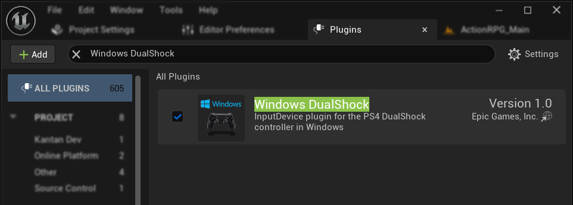
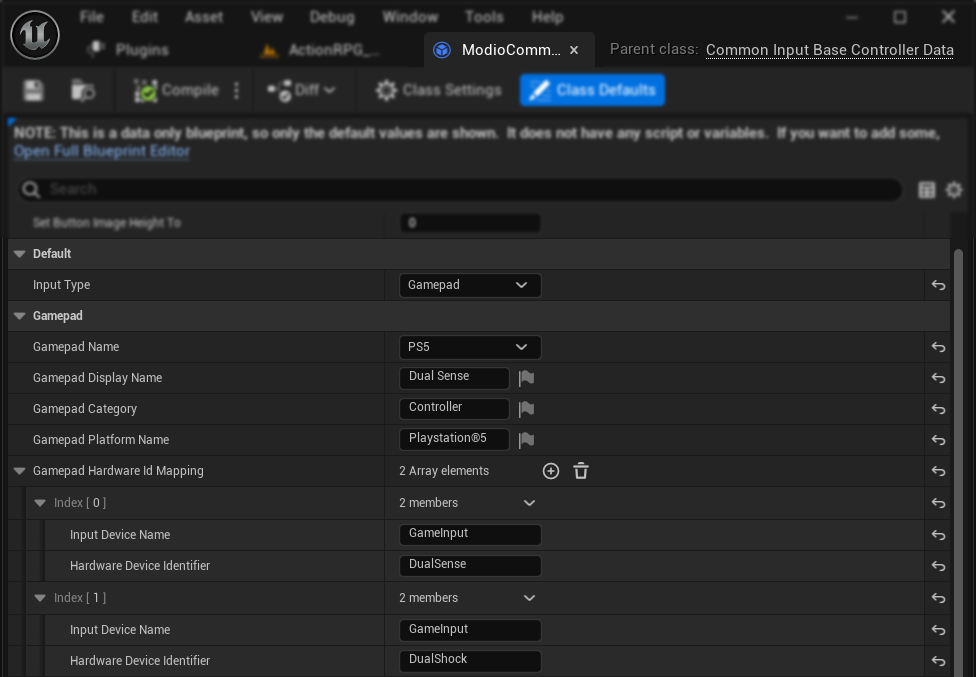

import Tabs from '@theme/Tabs';
import TabItem from '@theme/TabItem';

# Gamepad glyph switching

This guide explains the method for gamepad glyph switching in Common UI, which supports dynamic input glyphs for PlayStation and Xbox controllers on Windows.

## Supported UE versions

### UE 5.0 - 5.3

<Tabs groupId="platform">
<TabItem value="playstation" label="PlayStation">

#### PlayStation controller setup

1. Enable the `WinDualShock` plugin:
   - This plugin detects both DualShock (PS4) and DualSense (PS5) controllers.
   - **Note:** Requires a distribution license from Sony's PS4/PS5 SDK (LibScePad).



2. Configure Controller Data:
   - Open the `CommonInputBaseControllerData` asset for PS4/5 controller
   - Ensure the `Gamepad Name` in unique (not "Generic")
   - Add entries in the `Gamepad Hardware Id Mapping`:
     - Input Device Name: `FWinDualShock`
     - Hardware Device Identifier: 
       - `DualShock4` (for PS4)
       - `DualSense` (for PS5)


</TabItem>
<TabItem value="xbox" label="Xbox">

#### Xbox controller setup

1. Enable the `XInputDevice` plugin (enabled by default).


2. Configure Controller Data:
   - Open the `CommonInputBaseControllerData` asset for Xbox controller
   - Ensure the `Gamepad Name` in unique (not "Generic")
   - Add an entry in the `Gamepad Hardware Id Mapping`:
     - Input Device Name: `XInputInterface`
     - Hardware Device Identifier: `XInputController`


</TabItem>
</Tabs>

### UE 5.4+

<Tabs groupId="platform">
<TabItem value="playstation" label="PlayStation">

#### PlayStation controller setup

1. Enable New Plugins:
   - `GameInput`
   - `GameInputWindows`
   


2. Install Game Development Kit (GDK):
   - Refer to [Microsoft's GDK documentation](https://learn.microsoft.com/en-us/gaming/gdk/_content/gc/get-started-with-pc-dev/gc-get-started-with-unreal-pc) for access and installation (only necessary for Engineers).

3. Rebuild Plugins:

<Tabs groupId="engine-type">
<TabItem value="custom" label="Custom Engine Build">
- Rebuild the entire engine after GDK installation
</TabItem>
<TabItem value="epic-launcher" label="Epic Games Launcher Engine">
- Move plugin folders to your project's Plugins directory:
  - `Engine/Plugins/Experimental/GameInputWindows`
  - `Engine/Plugins/Runtime/GameInput`
- Regenerate project files
- Rebuild the project
</TabItem>
</Tabs>

4. Configure Controller Data:
   - Open the `CommonInputBaseControllerData` asset for PS4/5 controller
   - Ensure the `Gamepad Name` in unique (not "Generic")
   - Add entries in the `Gamepad Hardware Id Mapping`:
     - Input Device Name: `GameInput`
     - Hardware Device Identifier: 
       - `DualShock` (for PS4)
       - `DualSense` (for PS5)



5. Additional Configuration:
- Include the following in your `DefaultInput.ini` to allow recognition of the DualSense (PS5) and DualShock (PS4) devices:
```ini
[/Script/GameInputBase.GameInputDeveloperSettings]
+DeviceConfigurations=(DeviceIdentifier=(VendorId=1356,ProductId=1476),Description="PS4 Dual Shock controller",bOverrideHardwareDeviceIdString=True,OverriddenHardwareDeviceId="DualShock",bProcessControllerButtons=True,bProcessControllerSwitchState=True,bProcessControllerAxis=True,ControllerButtonMappingData=((1, "Gamepad_FaceButton_Left"),(2, "Gamepad_FaceButton_Bottom"),(4, "Gamepad_FaceButton_Right"),(8, "Gamepad_FaceButton_Top"),(16, "Gamepad_LeftShoulder"),(32, "Gamepad_RightShoulder"),(64, "Gamepad_LeftTrigger"),(128, "Gamepad_RightTrigger"),(256, "Gamepad_Special_Left"),(512, "Gamepad_Special_Right"),(1024, "Gamepad_LeftThumbstick"),(2048, "Gamepad_RightThumbstick"),(8192, "Gamepad_Special_Left")),ControllerAxisMappingData=((0, (KeyName="Gamepad_LeftX",DeadZone=0.239532,bIsPackedPositveAndNegative=True)),(1, (KeyName="Gamepad_LeftY",Scalar=-1.000000,bIsPackedPositveAndNegative=True)),(2, (KeyName="Gamepad_RightX",bIsPackedPositveAndNegative=True)),(3, (KeyName="Gamepad_LeftTriggerAxis")),(4, (KeyName="Gamepad_RightTriggerAxis",DeadZone=0.239532)),(5, (KeyName="Gamepad_RightY",Scalar=-1.000000,bIsPackedPositveAndNegative=True))),bProcessRawReportData=False,RawReportReadingId=0,RawReportMappingData=())
+DeviceConfigurations=(DeviceIdentifier=(VendorId=1356,ProductId=3302),Description="PS5 DualSense controller",bOverrideHardwareDeviceIdString=True,OverriddenHardwareDeviceId="DualSense",bProcessControllerButtons=True,bProcessControllerSwitchState=True,bProcessControllerAxis=True,ControllerButtonMappingData=((1, "Gamepad_FaceButton_Left"),(2, "Gamepad_FaceButton_Bottom"),(4, "Gamepad_FaceButton_Right"),(8, "Gamepad_FaceButton_Top"),(16, "Gamepad_LeftShoulder"),(32, "Gamepad_RightShoulder"),(64, "Gamepad_LeftTrigger"),(128, "Gamepad_RightTrigger"),(256, "Gamepad_Special_Left"),(512, "Gamepad_Special_Right"),(1024, "Gamepad_LeftThumbstick"),(2048, "Gamepad_RightThumbstick"),(8192, "Gamepad_Special_Left")),ControllerAxisMappingData=((0, (KeyName="Gamepad_LeftX",DeadZone=0.239532,bIsPackedPositveAndNegative=True)),(1, (KeyName="Gamepad_LeftY",Scalar=-1.000000,bIsPackedPositveAndNegative=True)),(2, (KeyName="Gamepad_RightX",bIsPackedPositveAndNegative=True)),(3, (KeyName="Gamepad_LeftTriggerAxis")),(4, (KeyName="Gamepad_RightTriggerAxis",DeadZone=0.239532)),(5, (KeyName="Gamepad_RightY",Scalar=-1.000000,bIsPackedPositveAndNegative=True))))
```
- For more details, see [Example Device Configurations](https://dev.epicgames.com/community/learning/tutorials/EpZ4/unreal-engine-game-input-for-windows-experimental-release-notes)

</TabItem>
<TabItem value="xbox" label="Xbox">
#### Xbox Controller Setup

Xbox controller configuration remains the same as in UE 5.0 - 5.3.
</TabItem>
</Tabs>