import Tabs from '@theme/Tabs';
import TabItem from '@theme/TabItem';

The mod.io UI framework provides a set of specifications, UI components, and editor tooling to allow UE developers to rapidly integrate mod.io plugin data and events into their game's UI, either directly into existing screens or in dedicated browser and discovery sections.

Of primary concern here is abstracting away as much plugin-specific code from the developer as possible while maintaining flexibility for developers to implement their UI in C++, UMG/Blueprint, or any combination of the two.

```mermaid
block-beta
    columns 4
    ComponentUIPluginLabel["Component UI Plugin"]
    block:ComponentUIPlugin:4
        columns 1
        block:TemplateGrp
        columns 4
            Template:1
            ModioModBrowser
            ModioModDetailsDialog
            ModioFilterPanel
        end
        block:ComponentGrp
        columns 4
        UIComponents["UI Components"]:1
            ModioDefaultButton
            ModioDefaultImage
            ModioDefaultModTile
        end
        ModioUISubsystem
    end

    CorePluginLabel["Core Plugin"]
    block:CorePlugin:4
        columns 1
        ModioSubsystem
        space
        ModioSDK["Modio C++ SDK"]
    end
ModioSubsystem-->ModioUISubsystem
ModioUISubsystem-->ModioSubsystem
ModioSDK---ModioSubsystem       
ModioSubsystem-->ModioSDK       

style CorePluginLabel stroke:#07C1D8
style ComponentUIPluginLabel stroke:#07C1D8
style TemplateGrp stroke:#07C1D8, fill:#2f2f2f
style Template stroke:#07C1D8
style ComponentGrp stroke:#07C1D8, fill:#2f2f2f
style UIComponents stroke:#07C1D8
style CorePlugin stroke:#07C1D8, fill:#1d1d1f
style ComponentUIPlugin stroke:#07C1D8, fill:#1d1d1f
```

## What's included

**Default Components:** Default widget implementations conforming to the specifications and requirements of each component.

**Component Interfaces:** A series of interfaces used for component-to-component communication, giving developers complete flexibility when creating custom component implementations.

**Infrastructure Classes and Helper Functions:** A UI-oriented subsystem and interface classes allowing widgets to register for plugin events, facilitating widgets that react to plugin events triggered externally.

**Template Implementation:** A full-featured implementation of a mod browser, featuring discovery and installation management, that can be copied into your own project as a template for customization or used as a reference for a custom implementation.

**Documentation:**

- [**Component Specifications:**](/unreal/ui-refdocs/#ui-component-specifications) Documentation for each component outlining the required interfaces and behavior that a custom implementation should include.

- [**Default Component Implementation Notes:**](/unreal/ui-refdocs/#ui-component-specifications) Documentation of specific information regarding the default implementations for each component.

- [**Component Usage Guide:**](/unreal/component-ui/building-a-screen/)
  A simple walkthrough of building a new UI screen from scratch, including how to facilitate communication between components and the UI subsystem, and a look at how to easily replace components or sub-components without code changes.

- **COMING SOON: Component Implementation Guide:**
A step-by-step demonstration of how to implement your own custom components, whether that be through wrapping your own existing widgets or creating a completely new conforming widget.

- **COMING SOON: Reference Implementation Walk-through:**
An examination of each screen in the reference implementation, discussing design principles and data flows between components.