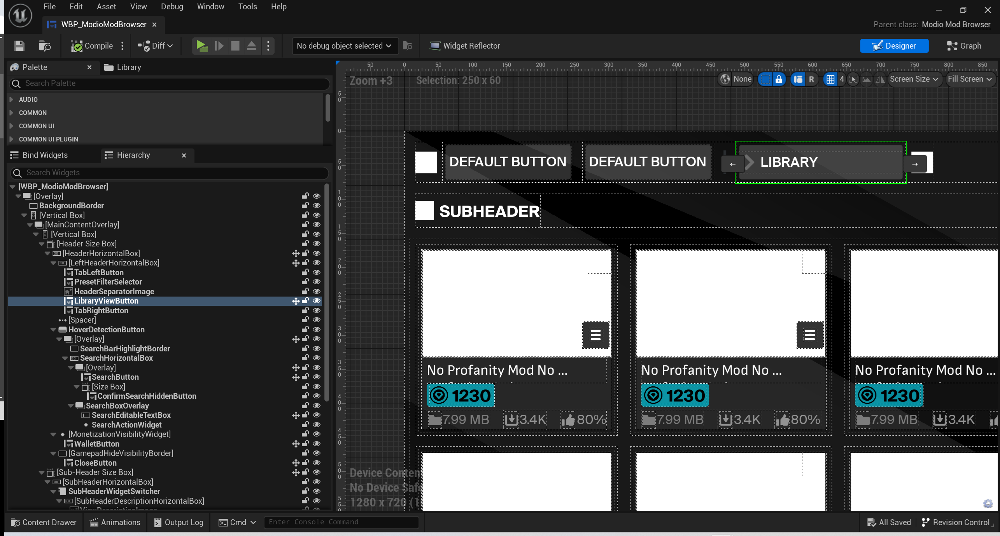
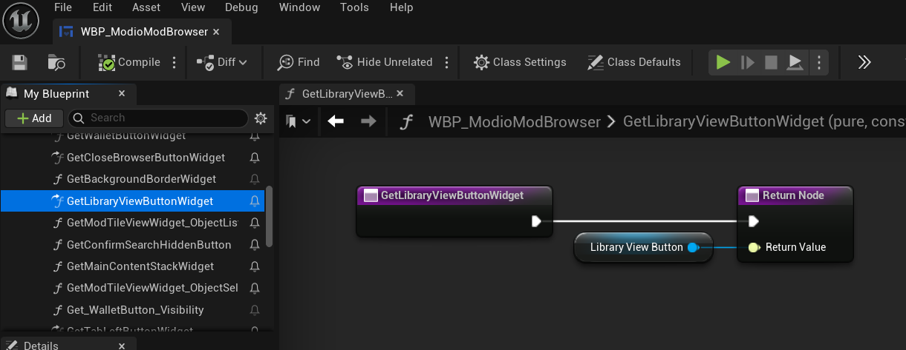
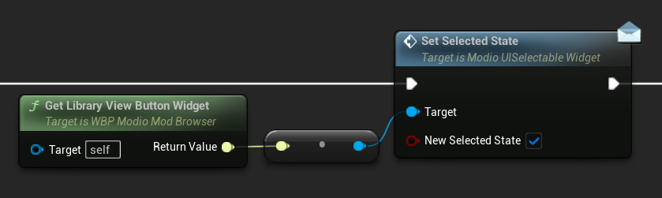

# Substituting Components

Substitutability of components is one of the core design features of the mod.io [Component UI](https://docs.mod.io/in-game-ui/component) framework. This guide explains how mod.io UI interfaces enable the substituting of mod.io default components for your own components in the template implementation of the component UI framework.

## Interfaces and getter functions

The previous guide to [building a simple mod browser from components](/unreal/component-ui/building-a-screen) demonstrates a basic use of the interface design pattern seen throughout the template UI implementation. The outermost browser widget is composed of multiple sub-components, however these are never referenced directly. Each sub-component is instead typed as a `UWidget` with a desired interface accessed via a getter function.

### `WBP_ModioModBrowser` library button example

`WBP_ModioModBrowser` contains the `LibraryViewButton` that, when clicked, displays the current user's subscriptions in the mod tile grid. 



Getter functions for `WBP_ModioModBrowser` are found in **My Blueprint** under **Functions -> mod.io -> UI -> Mod Browser -> Widget Getters**. Here `GetLibraryViewButtonWidget()` is found.



Some functions in `WBP_ModioModBrowser` are defined in the parent class `ModioModBrowser.h`, while others are defined only in `WBP_ModioModBrowser`. `GetLibraryViewButtonWidget()` is the former. Its definition in `ModioModBrowser.h` shows that it returns type `TScriptInterface<IModioUIClickableWidget>`.  

 ```cpp
UFUNCTION(BlueprintCallable, BlueprintNativeEvent, Category = "mod.io|UI|Mod Browser|Widget Getters", 
        meta = (BlueprintProtected))
TScriptInterface<IModioUIClickableWidget> GetLibraryViewButtonWidget() const;
```

`LibraryViewButton` is of type `WBP_ModioDefaultIconButton`. This type implements `IModioUIClickableWidget`, allowing it to be returned by `GetLibraryViewButtonWidget()`.  

:::note
`WBP_ModioDefaultIconButton` inherits `IModioUIClickableWidget` and more via `UModioDefaultIconButton` -> `UModioDefaultTextButton` -> `UModioButtonWidget`.
:::

`GetLibraryViewButtonWidget()` is used throughout `WBP_ModioModBrowser` to call functions that are made available by the `IModioUIClickableWidget`.


`GetLibraryViewButtonWidget()` returns `IModioUIClickableWidget` because this represents its most essential function as a button — being clicked. However, `WBP_ModioDefaultIconButton` implements many interfaces that are relevant to its function and styling: `IModioUIImageDisplayWidget`, `IModioUIHasTextWidget`, `IModioUISelectableWidget`, `IModioUIHoverableWidget` and more.  

In cases where an interface other than `IModioUIClickableWidget` functionality is required, `GetLibraryViewButtonWidget()` is still used. Its return value is either cast to the required interface, or a message function taking an **Object** reference is used.


*SetSelectedState is a message function.  It does nothing unless `Target` implements `IModioUISelectableWidget`*

:::note
With the exception of **Object** references, getter functions throughout the component UI *never* cast to a concrete type!
:::

## Creating custom components to substitute

By adhering to the above pattern, the template implementation allows you to substitute your own components directly into the Widget Blueprint provided the substituting component implements the expected interface(s). There are 3 ways to achieve this:
* [Wrapping an existing widget](/unreal/component-ui/custom-components#wrapping-an-existing-widget)
* [Creating a new widget](/unreal/component-ui/custom-components#creating-a-new-widget)
* [Subclassing an existing widget](/unreal/component-ui/custom-components#subclassing-an-existing-widget)

These techniques are explained in detail in [Creating Custom Components](/unreal/component-ui/custom-components).

## Substituting a component

After creating a new component that implements the required interfaces, remove the existing component.  Next, add your new component to the Blueprint hierarchy and getter function.  Configure any default values and styling options that are exposed to the outer widget, as needed.


## Next steps

Now you know how to sustitute an existing component, you may want to create your own componen for specific purposes. Check out our [Creating Custom Components](/unreal/component-ui/custom-components) guide. 