# Template UI Functionality

[Template UI](https://docs.mod.io/in-game-ui/template) is a fully featured in-game UGC browser that's built using [Component UI](https://docs.mod.io/in-game-ui/component). Template UI is designed to work straight out of the box. You can use it as is, or customize the UI to suit your needs. Below we'll take a look at the many aspects Template UI has to offer.

This guide covers:

* [UGC Browser](#ugc-browser)
* [UGC Tile](#ugc-tile)
* [Filter panel](#filter-panel)
* [UGC View](#ugc-view)
* [UGC Dependencies](#ugc-dependencies)
* [UGC Management](#ugc-management)
* [Reporting](#reporting)
* [Keyboard & mouse inputs](#keyboard--mouse-inputs)
* [Marketplace features](#marketplace-features)
* [Next steps](#next-steps)

## UGC Browser
This is the main portal for searching available UGC and managing subscriptions and purchases (if applicable). It has been built with scalability and compliance in mind — supporting multiple input devices, resolutions, and aspect ratios across all devices including ultrawide displays and the Steam Deck.

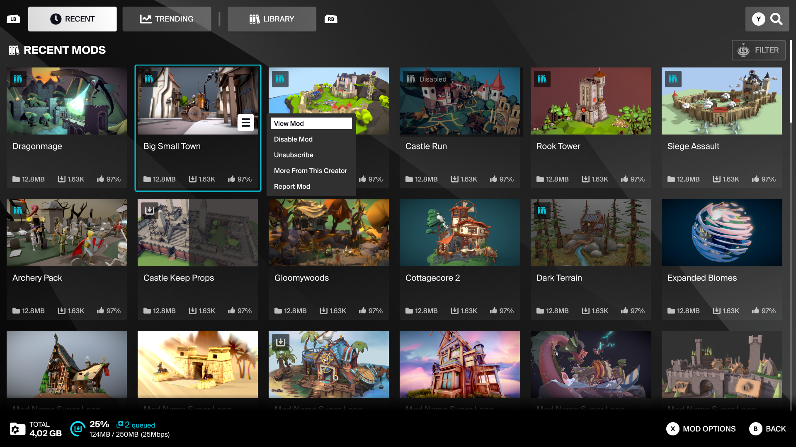

The mod browser’s content is split into 2 sections:
- **RECENT** and **TRENDING** for browsing the full set of UGC for your game, sorted according to the selected category. These categories can be customized in the **Project Settings -> Plugins -> mod.io UI**. 
- **LIBRARY** for browsing the current user's subscribed and purchased UGC 

On each page, use the **Search** or **Filter** options to find specific UGC or narrow down the number of UGC displayed.

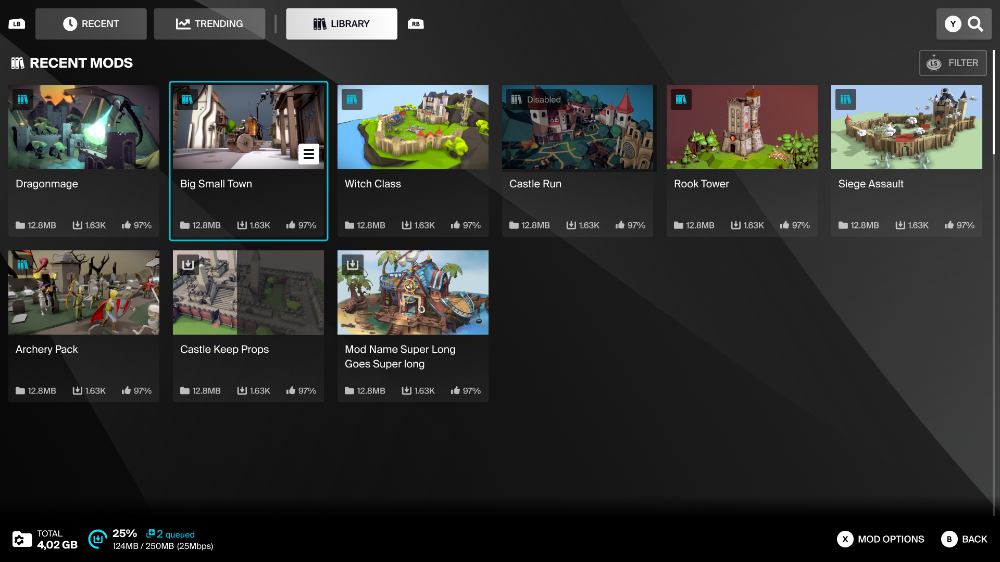

:::note
[Marketplace](https://docs.mod.io/monetization/marketplace) features must be enabled to allow the purchase of premium UGC.
:::

The browser’s footer has the **Storage Tracker** widget to show the total size of all installed UGC. It also features the **Operation Tracker** widget to show the number of UGC queued for installation, and the progress of the UGC currently being installed. The **Operation Tracker** will show the downloading and extracting operations in sequence.

\
&nbsp;

## UGC Tile

The **UGC Tile** shows the base information of the UGC including its thumbnail, name, metrics, and its current state (e.g. subscribed/unsubscribed, downloading, error, installed by another user). 

When highlighted it also includes a tooltip button featuring a set of **UGC Options**. This allows quick access to contextual actions such as subscribing/unsubscribing, enabling/disabling, or reporting UGC.
\
&nbsp;

## Filter panel
Filter categories can be check-boxes, where multiple options can be selected; or radio buttons, where only one option can be chosen.
Filters can be applied when browsing any of the UGC browser pages. Multiple filters can be applied at once to narrow down the list of UGC shown; these are grouped into categories which can be expanded or minimized. Navigating away from a page will clear any applied filter settings.

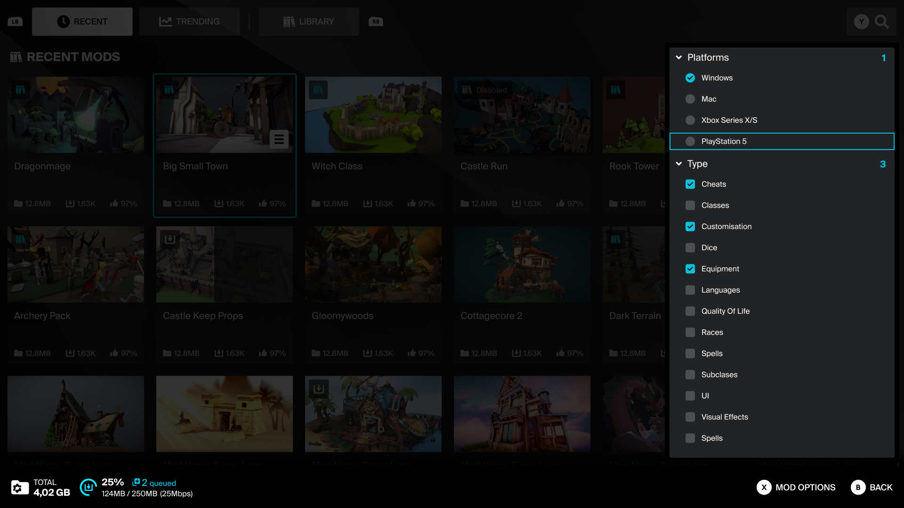
\
&nbsp; 

## UGC View

This page is viewed after clicking on a **UGC Tile** from the main browser page.  It displays detailed information for the selected mod.

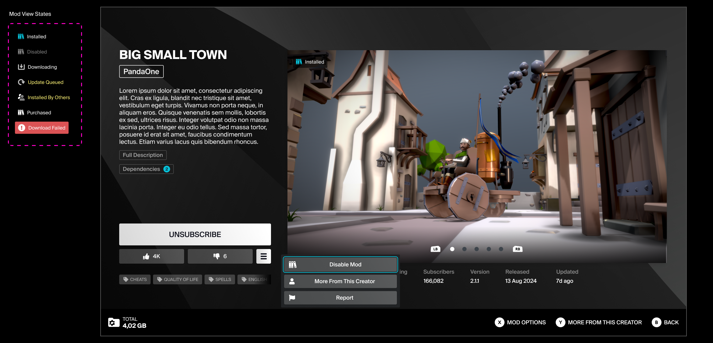

<RefTable colWidths={['20%', '80%']} stripes="odd">
| | |
|-|-|
|**Mod name**|The name of the mod concatenated to two lines|
|**Creator name**|The creator's mod.io username OR the console platform user name (with a platform icon). This name is clickable with the mouse or accessed with a face button on gamepad, and leads to a search of mods created by that user.|
|**Description**|A brief mod summary limited to 250 characters. If a longer description is available, **Expand Description** will be shown.  Clicking this button displays a modal with the full description.|
|**Subscribe / Unsubscribe**| This will toggle the mod's state between subscribed and unsubscribed, queuing it for installation or uninstallation. If the mod has dependencies, a modal listing these will be presented upon pressing subscribe.  This enables users to subscribe to the mod and all its dependencies at the same time. If [Marketplace](https://docs.mod.io/monetization/marketplace) features are enabled, **Subscribe** will be replaced with **Purchase Mod** for any premium mods.|
|**Like / Dislike**| Mods can be rated with likes or dislikes. The buttons act as a toggle — only one can be active at a time. The ability to dislike a mod can be toggled on or off by checking **Enable Mod Downvoting in UI** in **Project Settings -> Plugins -> mod.io**.|
|**Mod Options**| This button opens a tooltip with a list of contextual options depending on the mod's current state.|
|**Dependencies**| If a mod is dependent on other mods, this button will be available to display a list of dependencies. This list is not interactive — it simply lists the names, size, and subscribed/downloaded state of each mod.|
|**Metrics**| The mod's file size, downloads, rating (%), subscribers, version number, release date, and the date it was last updated|
|**Mod State** | Indicates whether the mod is installed, queued, downloading (with %), errored, installed by others, or purchased.|
|**Gallery** | A set of images for the user to browse.|
|**Category Tags**| The tags assigned to this mod. Selecting one will open a unique search based on the tag value.|
</RefTable>
\
&nbsp;

## UGC Dependencies
If UGC has dependencies, a list of the required UGC can be accessed from the **UGC View** via the **Dependencies** button. This modal lists the required UGC, their individual and total file size, and installation status.

After pressing **Subscribe** on a piece of UGC with dependencies, the list of required UGC will be shown in a confirmation prompt. Pressing **OK** will subscribe to UGC and all its dependencies.

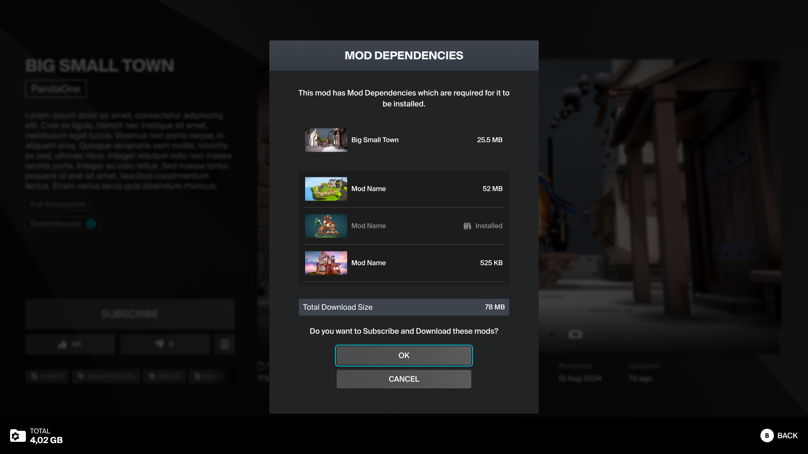

:::note
This does not apply to premium UGC — only free UGC can have dependencies, or be used as dependencies.  See [Dependency Management](https://docs.mod.io/dependency-management) for more information.
:::

## UGC Management
Developers can allow users to enable or disable UGC they have subscribed to as a way of managing their library. This is separate from unsubscribing — disabling UGC will keep it installed on the user's hard drive, but make it inactive in their game. Check **Enable Mod Enable/Disable support widgets in UI** in **Project Settings -> Plugins -> mod.io** to toggle the visibility of the relevant widgets for this feature.

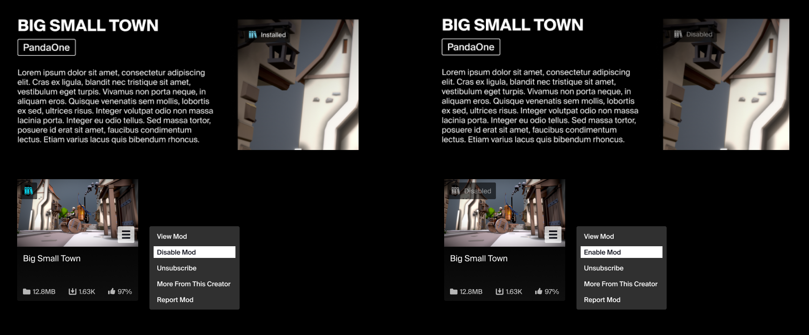

A piece of UGC's enable/disable state can be toggled via the **Mod Options** menu of the **UGC Tile** or **UGC View**. UGC's installation status icon will be updated accordingly as either *Installed* or *Disabled*.

If [Marketplace](https://docs.mod.io/monetization/marketplace) features are enabled, a state indicator for a purchased piece of UGC will show:
- **Subscribed** and **Enabled** = "Installed"
- **Subscribed** and **Disabled** = "Disabled"
- **Unsubscribed** = "Purchased"
\
&nbsp;

## Reporting

The reporting modal can be accessed via the **Mod Options** tooltip on the **UGC Tile** and **UGC View**. It features:
- Mod name
- The mod version number
- Mod thumbnail
- Report reason list (Generic, Not Working, Illegal Content, False Information, DCMA, Rude Content, Stolen Content, Other)

Selecting any of the report reasons opens a reporting details modal, where a user can describe the issue further and submit their report. The details are a required field, so the **Submit** button will remain disabled until any text has been typed into the field.
\
&nbsp;
## Keyboard & mouse inputs

The Template UI has been designed with a "console first" mentality, ensuring all interactions and UX flows work well on gamepad, and then expanding them to suit keyboard & mouse interactions.

When any gamepad or keyboard & mouse input is detected, the UI will swap its key bindings and add or remove layout elements to suit the current platform.  For example, modals having a clickable close button when using keyboard & mouse, or actions being assigned to a gamepad's face button rather than a UI button.

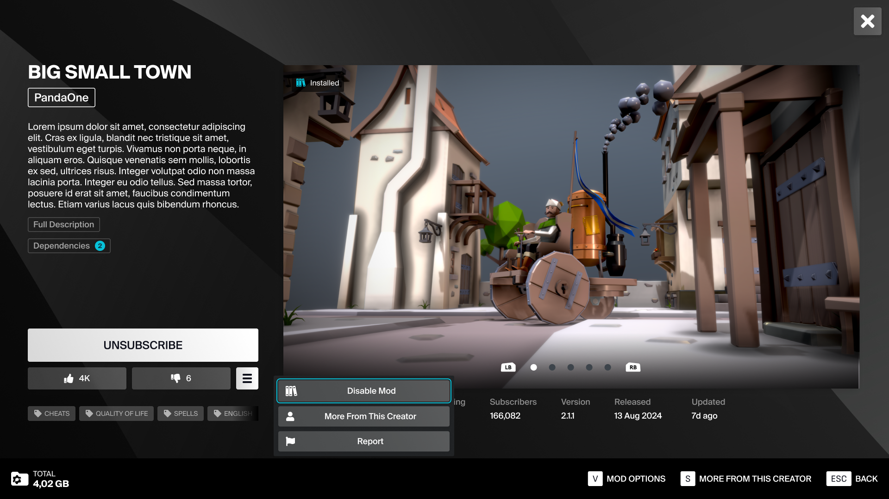

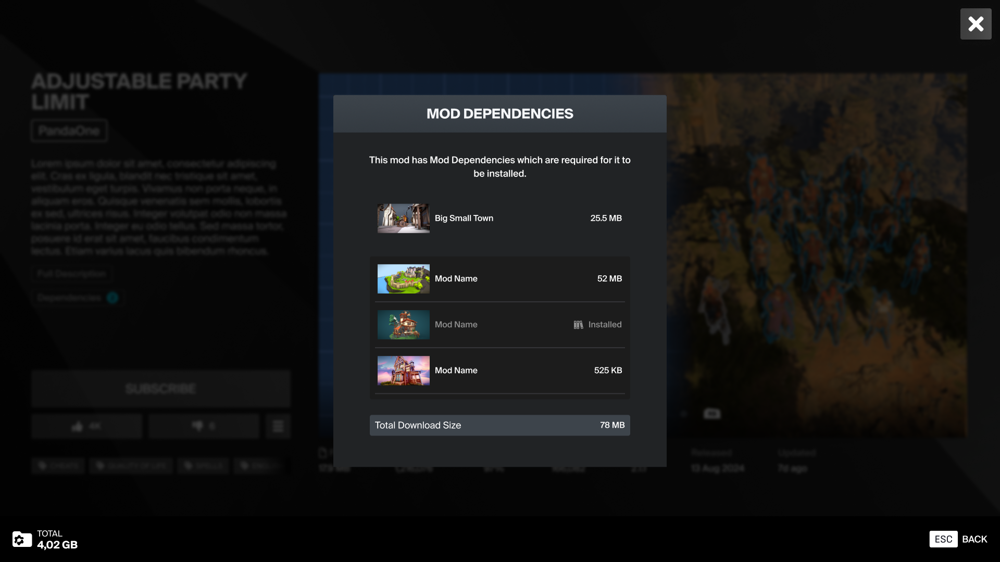
\
&nbsp;

## Marketplace features
If you have [Marketplace](https://docs.mod.io/monetization/marketplace) features enabled for your game, check **Enable Monetization widgets in UI** in **Project Settings -> Plugins -> mod.io**.  The Template UI will automatically toggle on the relevant UI elements and modify the user flows to accommodate the addition of the Marketplace features.

### UGC tokens & premium UGC
The main change Marketplace brings to the mod browser is the addition of **Mod Tokens**. This is a currency unique to each game, and as such should be represented by an icon and name unique to your game.

 

The user's total tokens are shown in the **Token Wallet** in the mod browser's header, and will be visible on any screen that relates to browsing or purchasing Mods. Any premium mods listed in the browser will adjust the standard **UGC Tile** layout to add the token price or **Purchased** tag.

Any mods that are purchased can be found in the library page, where new options will be available to let the user filter between **All Mods**, **Installed**, or **Purchased**.

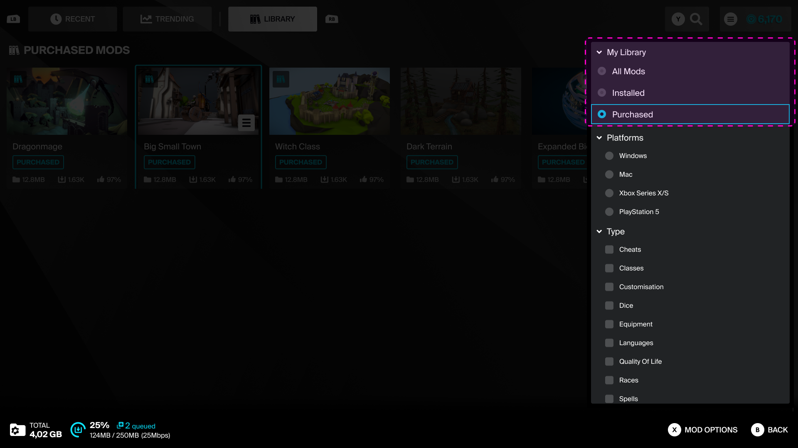

### UGC View & purchasing UGC
On the **UGC View** screen, premium mods will always be identified by a premium tag in the top right of the gallery image. Any UGC not yet purchased will have their **Subscribe/Unsubscribe** button replaced with a **Purchase Mod** button showing its cost.

Pressing **Purchase Mod** will show a confirmation modal, displaying the UGC details and price. If the user has insufficient tokens to purchase the mod, the modal will communicate this and block the purchase.

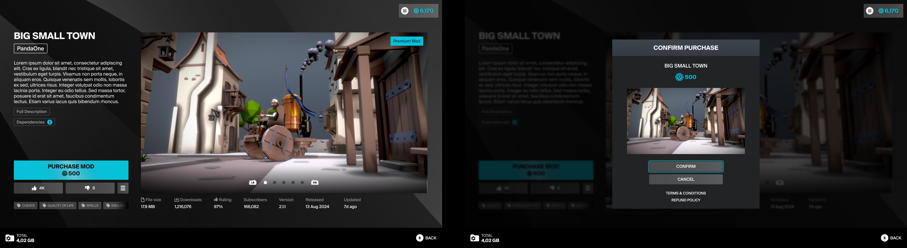

Successfully purchasing a mod also subscribes the user in the same action. Once a user owns a premium mod, the **Purchase Mod** is replaced with the **Unsubscribe/Subscribe** toggle again. Once purchased, a mod will stay in the user's library whether it is subscribed or not. Any purchased mods can be found in the **Library** page.

 

When prompted to buy more Tokens on PlayStation, Switch or Steam, the Template UI will call on the native platform marketplace UI to handle all token purchases. However, when prompted to buy tokens on Xbox & Oculus platforms, an internal modal will be used to list available token packs.

All token pack purchases will sync with the user's account and update their total tokens immediately.

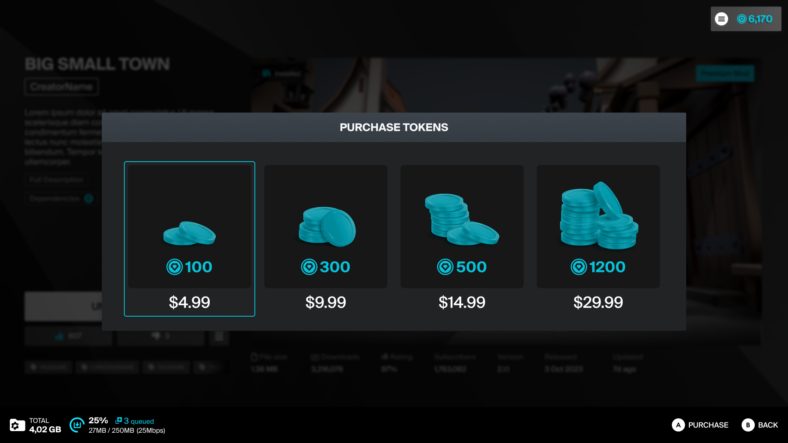

## Next steps

Next head over to the [Template UI Layouts](/unreal/template-ui/layouts) guide to explore the main layouts and widgets that make up Template UI.