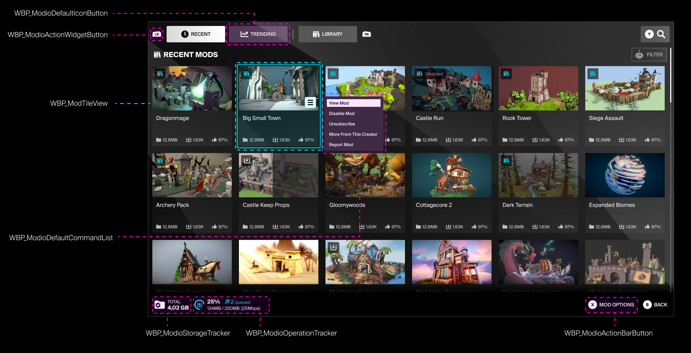
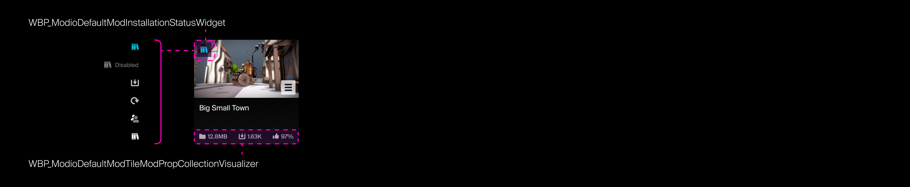
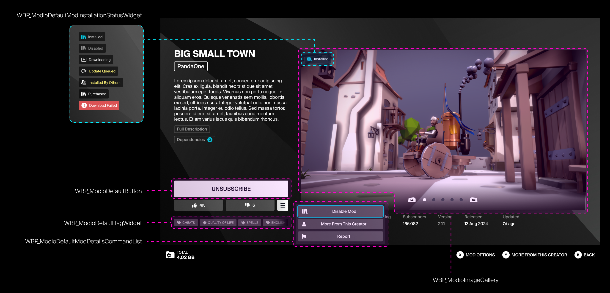
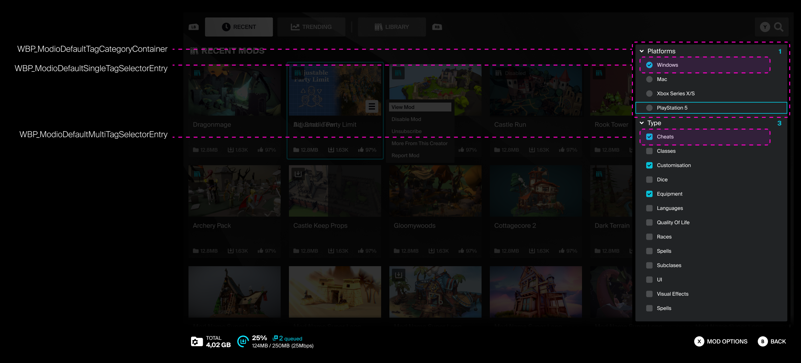
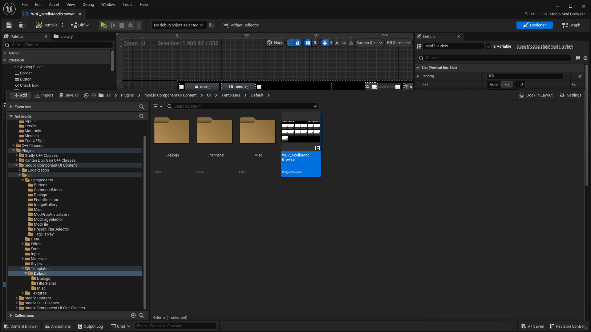
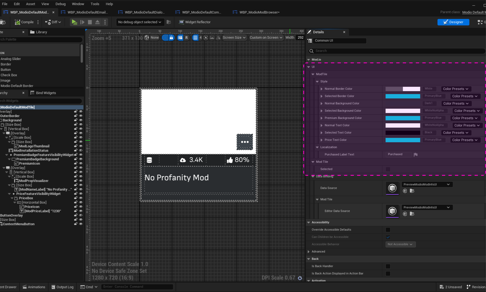
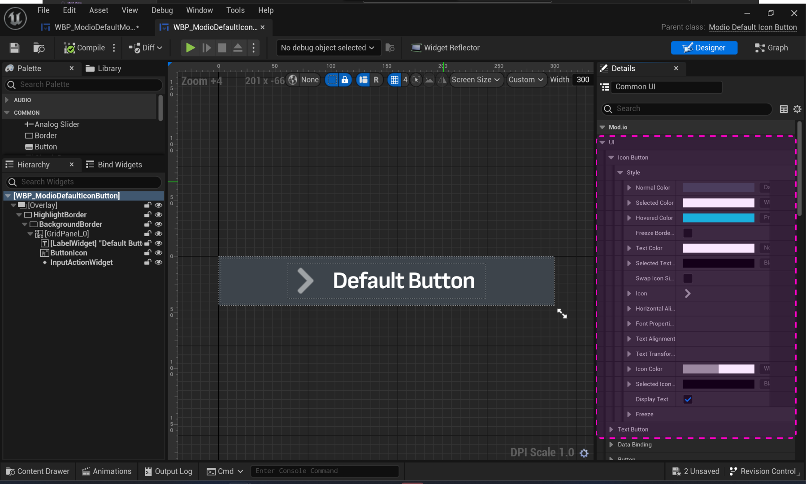
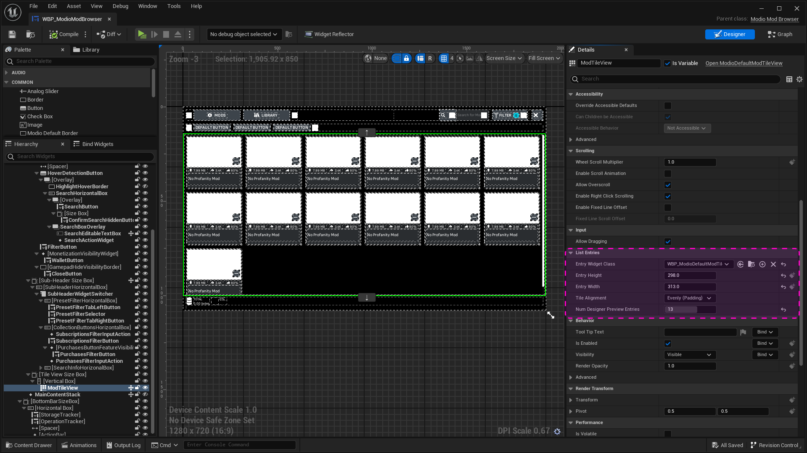

# Template UI Layouts

Now you have familiarized yourself with the [Template UI Functionality](/unreal/template-ui) guide, here's a brief breakdown of the main layouts and widgets that make up [Template UI](https://docs.mod.io/in-game-ui/template), and how to modify them to suit your needs. 

This guide covers:

* [Layouts and widgets](#layouts-and-widgets)
* [File locations](#file-locations)
* [Modifying layouts](#modifying-layouts)  

## Layouts and widgets

:::note[Customization]
For a comprehensive look at creating and substituting your own components into Template UI, see [Creating Custom Component](/unreal/component-ui/custom-components) and [Substituting Components](/unreal/component-ui/substitute-components)
:::

### [WBP_ModioModBrowser](/unreal/ui-refdocs#wbp_modiomodbrowser)

This is the main layout for the mod browser.
The layouts are built to be navigable on both keyboard & mouse and gamepad.  The layout will scale responsively to different screen aspect ratios.
 \
 

### [WBP_ModioDefaultModTile](/unreal/ui-refdocs#wbp_modiodefaultmodtile)

The mod tile that will populate the browser. Their scale and padding in the browser can be set via the `WBP_ModioDefaultModTile` layout in the `WBP_ModioModBrowser` layout.

### [WBP_ModioModDetailsDialog](/unreal/ui-refdocs#wbp_modiomoddetailsdialog)

While the thumbnail gallery should be kept at a consistent aspect ratio of 16:9, the rest of the layout & widgets can be scaled to suit your current layout.

### [WBP_ModioFilterPanel](/unreal/ui-refdocs#wbp_modiofilterpanel)

The filter panel uses both radio and check boxes for filter and sort options, broken down into sub-categories that can be expanded or collapsed.

## File locations

The main working layout for the mod browser is `WBP_ModioModBrowser`, which can be found under 
`ModioComponentUI/Content/UI/Templates/Default`.

Generally, layouts and elements which have a specific use such as confirmation modals, storage widgets, unique buttons etc. can be found in the `UI/Templates` folder, and general core elements like buttons, modals, image galleries, etc can be found in the `UI/Components` folder.

## Modifying layouts

A UI style element is applied to a range of widgets, and allows for colours assigned to their states (static, highlighted, selected, premium, etc) to be called from a data table called `DT_UIColors`.
\
 

### [WBP_ModioDefaultModTile](/unreal/ui-refdocs#wbp_modiodefaultmodtile)

<RefTable colWidths={['20%', '80%']} stripes="odd">
| | |
|-|-|
|Border Colour|The outline on highlighted mod tiles|
|Background Color|The base colour behind the mod name and details|
|Text Color|Colour of the  mod name & details|
|Price Text Color|Colour of the Price tag on Premium Mods|
</RefTable>
\
&nbsp;

### [WBP_ModioDefaultButton](/unreal/ui-refdocs#wbp_modiodefaultbutton) and [WBP_ModioDefaultIconButton](/unreal/ui-refdocs#wbp_modiodefaulticonbutton)

Most buttons will use these as a parent, so the following UI settings will be available to their children:

<RefTable colWidths={['20%', '80%']} stripes="odd">
| | |
|-|-|
|Button Color|Color of the base of the button|
|Icon Type|Setting the icon sprite for the `IconButton` variant|
|Text Color|Color of the icon text|
|Text Size|Font size of the icon text|
|Font Properties|Font Family, style, size, spacing, skew, material, and outline|
|Text Alignment|Left, right, centre, or fill|
|Text Transform Settings|Upper case, lower case, or none|
</RefTable>
\
&nbsp;

### [WBP_ModioModBrowser](/unreal/ui-refdocs#wbp_modiomodbrowser)

Inside [WBP_ModioModBrowser](/unreal/ui-refdocs#wbp_modiomodbrowser), you can find a modified grid layout named `ModTileView`. This is populated with [WBP_ModioDefaultModTile](/unreal/ui-refdocs#wbp_modiodefaultmodtile). The `ModTileView` layout controls the size and padding of the tiles.

The size of the thumbnail is locked to a 16:9 aspect ratio — while the mod tiles can be resized to suit your needs, by default they will need to work around this restriction.
